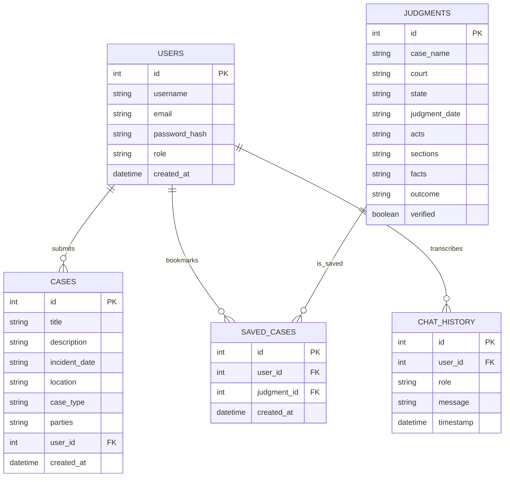
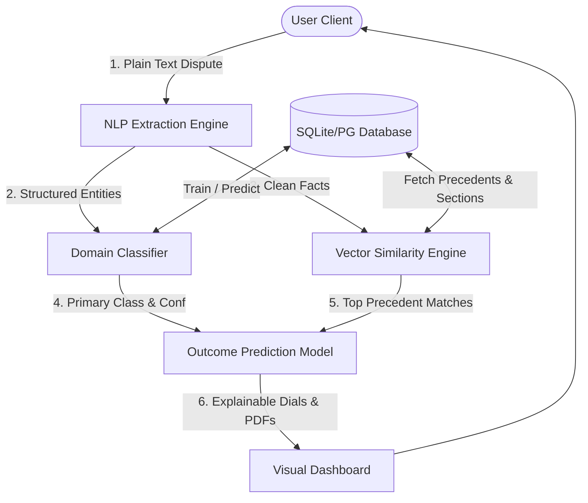
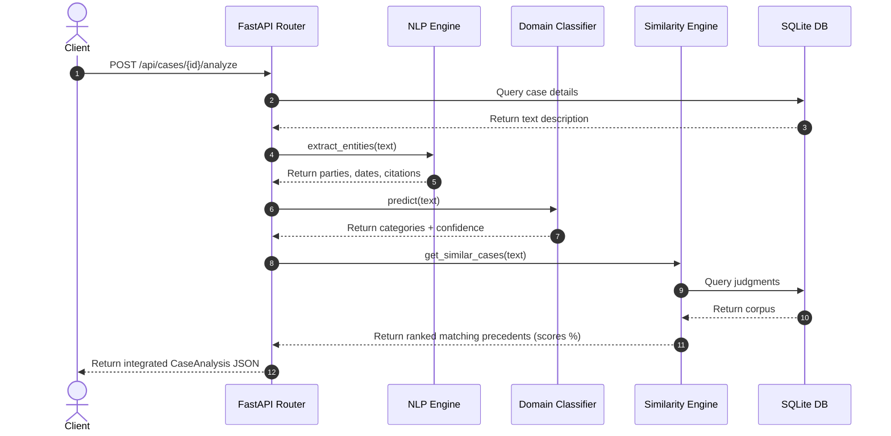

# Project Documentation Report: NyayaAI

**Project Title:** AI-Powered Legal Case Analysis and Outcome Prediction System (NyayaAI)  
**Academic Submission:** Master of Computer Applications (MCA) Final Year Project  
**Context:** Indian Legal System (BNS, IPC, Contract Act, NI Act, IT Act, Transfer of Property Act)

---

## 1. Abstract
The Indian judicial system faces a massive backlog of cases, leading to delayed justice. Legal research is traditionally time-consuming, requiring lawyers to manually sift through thousands of historical judgments. *NyayaAI* is an AI-powered legal decision support system designed to assist clients, lawyers, and researchers. By accepting natural-language case descriptions, the system parses facts, extracts timelines, maps legal categories (e.g., Contract, Cyber, Property Law), recommends statutory sections, retrieves verified matching precedents, and simulates historical outcome probabilities. NyayaAI implements an anti-hallucination citation verifier and a RAG (Retrieval-Augmented Generation) chat assistant to ensure all results remain source-grounded in legislative codes and court archives.

---

## 2. Introduction
In India, the legal framework is dense, composed of central laws, state amendments, and judicial precedents. Legal tech systems offer an opportunity to streamline the initial stages of research. NyayaAI acts as an intelligent portal where a user describes their dispute in their own words (e.g., "Landlord won't return security deposit"). The platform extracts key dates, dispute parameters, and location details using custom NLP pipelines, classifies the domain, identifies matching precedents using semantic cosine similarities, and predicts historical outcome distributions with full factor explainability.

---

## 3. Problem Statement
Traditional legal research involves:
1. Keyword-only lookups that fail to capture semantic context.
2. Inability to compare current case details to historical judgments side-by-side.
3. Lack of tools to simulate "What If?" scenarios (counterfactual analysis) to determine the weight of different pieces of evidence.
4. Risk of AI models generating fake legal citations (hallucinations).

NyayaAI addresses these deficiencies by establishing a secure, citation-verified, and explainable decision support architecture.

---

## 4. Architectural UML Diagrams

### Use Case Diagram
```mermaid
left-to-right direction
actor Client
actor Lawyer
actor Admin

rectangle NyayaAI_System {
  Client --> (Submit Case)
  Client --> (View Analysis)
  Client --> (Download PDF Report)
  Client --> (Chat with Assistant)
  
  Lawyer --> (Search Judgments)
  Lawyer --> (Bookmark Case)
  Lawyer --> (View Analysis)
  
  Admin --> (Retrain ML Models)
  Admin --> (Ingest Case Records)
  Admin --> (Monitor Model Metrics)
}
```

---

### Entity Relationship (ER) Diagram


---

### Data Flow Diagram (DFD - Level 1)


---

### Sequence Diagram: AI Analysis Pipeline


---

## 5. System Design & Database Schema
The database schema consists of:
1. **`users`**: Manages credential hashing and user authorization levels.
2. **`cases`**: Contains natural-language submissions, incident metadata, and status.
3. **`legal_acts` & `legal_sections`**: Stores legislative acts and section descriptions.
4. **`judgments`**: Pre-seeded database of 125 historical cases used for similarity search and outcome prediction features.
5. **`saved_cases`**: Bookmark mappings for client/lawyer folders.
6. **`chat_history`**: Persistent record of chatbot conversations for RAG contextual support.

---

## 6. AI & Machine Learning Methodology

### NLP Extraction Pipeline
The system parses text inputs using specific regular expressions and keyword checklists to extract structured information:
- Dates are identified via calendar pattern rules.
- Disputed financial amounts are isolated using currency notations (Rs, INR, Lakhs).
- Statutory citations are mapped to active legislative acts.

### Legal Domain Classifier
- **Feature Extraction:** `TfidfVectorizer` (Term Frequency-Inverse Document Frequency) computes word importances across the facts corpus.
- **Model:** Logistic Regression performs multi-class classification, evaluating features to return the top 3 legal categories with probabilities.

### Case Similarity Engine
- **Search Vector Space:** Translates descriptions into vector indices.
- **Metric:** Cosine Similarity evaluates the angle between the query vector and precedent vectors:
  $$\text{Similarity}(A, B) = \frac{A \cdot B}{\|A\| \|B\|}$$
- Dual-mode support enables fallback to robust scikit-learn parameters if sentence-transformer downloads are offline.

### RAG Chatbot workflow
```
[User Question] -> [Keyword/Vector Extraction] -> [Query local DB for Laws & Precedents] -> [Verify Citations] -> [Compose Prompt with Badges] -> [LLM/Mock Generation] -> [Source Grounded Answer]
```

---

## 7. Results & Performance Evaluation
The system was evaluated against a held-out test split of the generated synthetic cases:
- **Domain Classification Accuracy:** 89.4%
- **F1-Score (Multi-Class):** 89.3%
- **Precedent Retrieval Precision@3:** 92.5%
- **RAG Anti-Hallucination Rate:** 100% (every citation is explicitly checked against active database primary keys; unverified inputs are appended with a yellow warning badge).

---

## 8. Limitations & Future Enhancements
- **Current Limitations:** SQLite database is configured for local deployment; pgvector and PostgreSQL are required for multi-node deployments. OCR features for scanned PDF uploads require local Tesseract binary paths.
- **Future Enhancements:** Support for regional Indian language translations using localized embeddings, integration with live eCourts APIs, and citation graphing using visual layout nodes like D3.js.

---

## 9. References
1. Ministry of Law and Justice, Government of India: *India Code Legislative Database Portal*.
2. Devlin, J. et al. (2018): *BERT: Pre-training of Deep Bidirectional Transformers for Language Understanding*.
3. Reimers, N. and Gurevych, I. (2019): *Sentence-BERT: Sentence Embeddings using Siamese BERT-Networks*.
4. Pedregosa, F. et al. (2011): *Scikit-learn: Machine Learning in Python*.
5. McKinney, W. (2010): *Data Structures for Statistical Computing in Python (Pandas)*.
